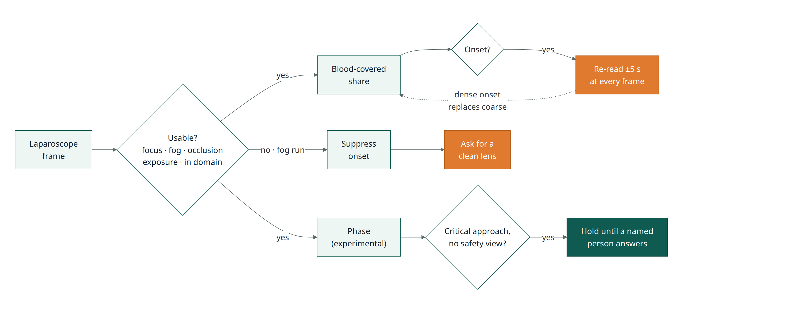
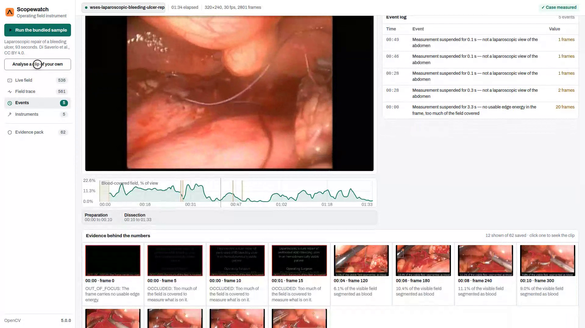
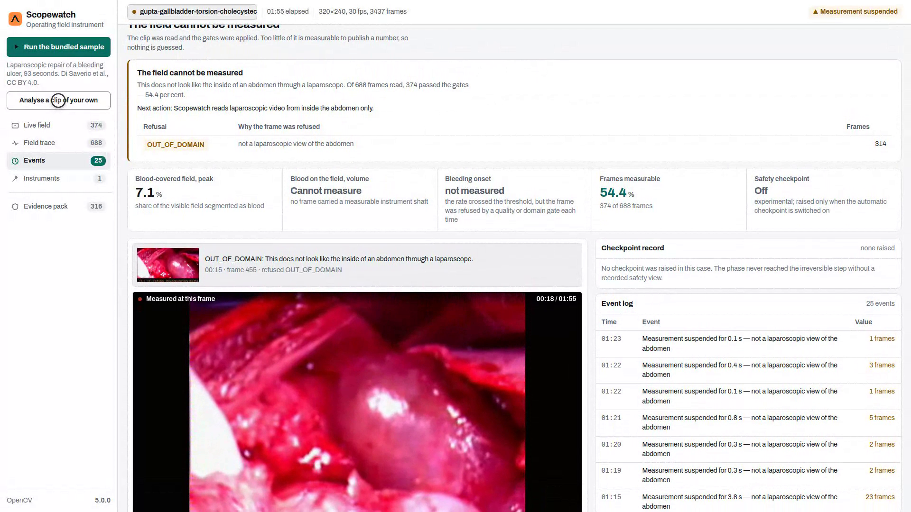

::: meta
**Live** s3vrzphtvv.eu-central-1.awsapprunner.com · **Code** github.com/rogerkorantenng/scopewatch · **OpenCV** 5.0.0 (pinned) · **AWS** App Runner, eu-central-1 · **Awards** Overall, Agentic Vision
:::

::: {.cols}
## Abstract

Scopewatch reads the camera feed that is already in a laparoscopic operation. It reports how much of the field is covered in blood and how fast that is changing. It gives a volume only when the instrument scale holds, and it refuses frames it can't read. On frames held out from tuning, 63.6% of the pixels it calls blood are blood; across all fifteen laparoscopic clips, 78.2%. It was tuned and tested on sixteen openly licensed surgical videos, split by clip so no clip informs its own score.

## 1. The problem

Blood loss in surgery is usually judged by eye, and the eye is wrong. In a 2024 study of caesarean deliveries in northern Uganda, visual estimation underestimated blood loss in 90% of cases. 21% of patients had over 1,000 ml of undiagnosed haemorrhage, and by visual estimate none of them had haemorrhaged at all (Edilu et al., *Ther Adv Reprod Health*, 2024).

A second step also depends on the eye. A review of 548 laparoscopic gallbladder videos in Chile found the critical view of safety was achieved in 66.5% of the easiest cases and 14.3% of the hardest (*Surg Endosc*, August 2026). The safety step is skipped most where it matters most.

In both cases the information is already on a camera in the room.

## 2. Users

The surgical team, who get a steady trend rather than a guess. The theatre lead, who reviews a case afterwards from its record. Scopewatch is a measurement aid, not a decision-maker.

## 3. OpenCV 5 implementation

The laparoscope projects a lit circle, and every fraction is taken against that circle rather than the rectangular frame. `connectedComponentsWithStats` recovers it. Blood is decided on chroma per unit lightness, red hue and saturation relative to the scene, with thresholds chosen on hand-labelled real frames. An earlier version relied on "darker than its surroundings", which also described the shadow at the rim of the scope, and it read that shadow as 9.79 ml.

Scale comes from instrument shafts of known diameter, measured edge to edge on saturation profiles. `cv2.phaseCorrelate` gives camera motion in under a millisecond. YOLOX-tiny runs through `cv2.dnn` as ONNX. OpenCV 5 removed the Caffe and Darknet readers, so ONNX is the only path, and we chose an Apache-2.0 model over AGPL detectors.

## 4. AWS deployment

A container in ECR runs on App Runner in eu-central-1 at 2 vCPU and 4 GB. The sample clip and model are baked into the image, so a judge can run it cold with one click. The deployed service matched a local run field for field on three real clips.
:::

## 5. The agent loop

The loop closes in three places. An onset found on the coarse pass triggers a re-read of that ten-second window at every frame, and the dense onset replaces the coarse one. A run of fogged frames suppresses the onset detector and asks for a clean lens instead of raising an alarm. With the experimental checkpoint switched on, a critical approach without a recorded safety view is held until a named person confirms it or dismisses it with a reason. Nothing clears it automatically.

| Evidence on six scripted cases | Result |
|---|---|
| Dense re-read triggered | **3 of 6**: exactly the 3 cases with a bleed, none of the 3 without |
| Bleeding onset detected / false onsets | 3 of 3 / 0 of 3, mean timing error 1.55 s |
| Checkpoint raised when the wide device entered | 6 of 6, 4.0 s after entry |

The first row is the one that matters for the loop. It acts on what the pixels show, not on a schedule. Every transition is written to the run record with its evidence frames.

::: {.cols}
## 6. Evaluation on real surgery

Sixteen openly licensed laparoscopic and open-surgery videos, split by clip into eight dev clips (thresholds chosen there) and eight held-out clips, with 64 hand-labelled frames.

| Blood pixels | Precision | Recall |
|---|---|---|
| **Held-out clips** | **63.6%** | 7.7% |
| Dev clips | 82.2% | 40.1% |
| All fifteen laparoscopic clips | **78.2%** | 23.2% |

A pixel is blood when it clears three tests at once: Lab chroma above an absolute floor, chroma-per-lightness above a multiple of the scene's own median, and a hue inside a band around that median. The three constants are chosen by maximising F-0.5 under leave-one-clip-out, weighting precision over recall, because a surgical overlay should be right when it marks something.

Across all sixteen clips, volume reads `CANNOT_MEASURE` every time, because two instruments at different depths vary the scale by 29 to 61% within a clip. Open surgery is refused as out of domain.

We also trained a learned segmenter on the GPU with CholecSeg8k, m2caiSeg and DSAD, exported to ONNX and run through OpenCV 5's own `cv2.dnn`. On the same held-out frames it reached 5.9% precision against the colour rule's 63.6%. On a corpus this size the classical method wins by an order of magnitude, and it is what ships. The numbers are in `docs/evaluation.md` §6.

## 7. Limitations

- Tuned to be right when it marks something, so some blood is left unmarked.
- No clip in this corpus passes the scale gate, so no millilitre figure is shown, and none has been checked against a measured one.
- Bleeding onset does not fire on a moving laparoscope; no stabilisation or registration is attempted.
- The checkpoint cannot tell a clip applier from a grasper nearer the lens, so it is off by default.
- Everything rests on 64 labelled frames across sixteen clips.

## 8. Responsible use

Scopewatch is not a medical device and has not been clinically validated. It withholds numbers it can't support, names why, and leaves every decision to the surgical team. The checkpoint never resolves itself. The real clips contain no faces or patient identifiers.
:::

