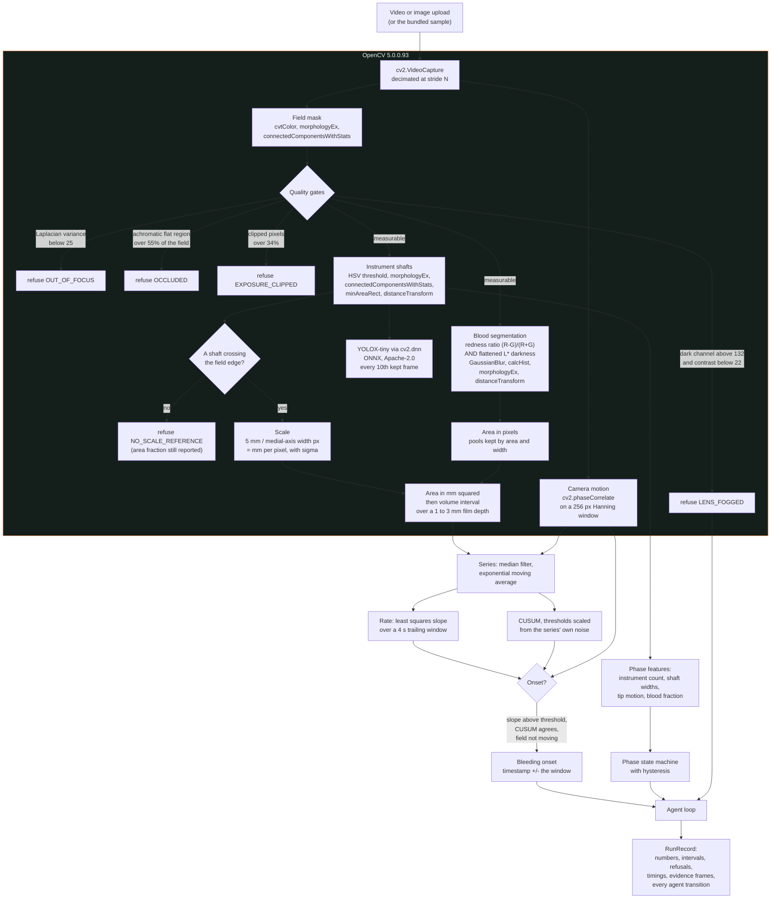
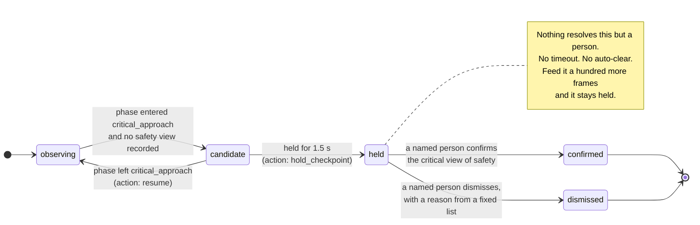
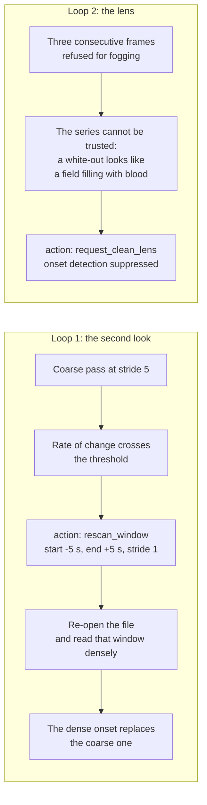
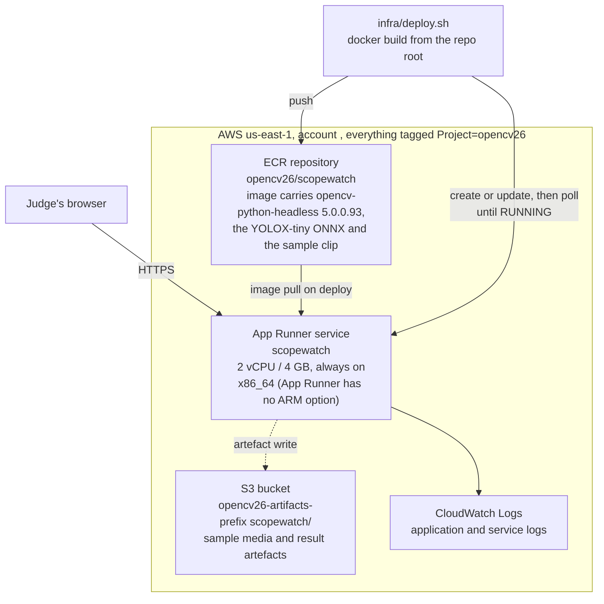

# Scopewatch architecture

Three diagrams: the vision pipeline, the agent loop the Agentic Vision award asks
for, and the AWS components.

---

## 1. The vision pipeline

Everything in the shaded band is OpenCV 5. The order is deliberate: the quality gates
run **before** the segmenter, so there is no code path in which an unmeasurable frame
produces a number that something downstream could pick up.

---

## 2. The agent loop

The competition rules state the bar: *"image or video results must influence a
subsequent plan, tool call, action, or request for human approval... the visual
evidence must change what the system does next."*

Three closures. Each one changes what the pipeline does, not what it prints.

The two loops that run alongside the state machine:

A clip with no bleed in it never triggers loop 1. That is what makes it a loop rather
than a fixed sequence, and it is asserted in
`tests/test_pipeline.py::test_a_quiet_case_never_triggers_a_second_read`.

**Autonomy, stated plainly.** Scopewatch takes no clinical action. It measures, it
asks, and it records what a person decided. Every checkpoint is resolved by a named
human; none expires, times out or resolves itself. The service refuses an anonymous
confirmation and refuses a dismissal with no reason, and both refusals are tested.

---

## 3. AWS

**Why App Runner and not Lambda or EC2.** The endpoint has to work for a judge from a
cold start with one click and no local file, over an unattended two-week judging
window. App Runner gives an always-on HTTPS endpoint with a managed certificate and no
load balancer, which matters because an ALB costs about $16 a month at zero traffic
and five entries would pay it five times. Lambda would have been cheaper still, but a
one-to-two gigabyte OpenCV container's cold start is unmeasured and a judge who waits
thirty seconds for a first response has already formed a view. EC2 would have needed a
certificate and a reverse proxy we would then have to keep alive.

**Why x86_64 and not Graviton.** App Runner exposes no ARM option in its pricing, its
FAQ or its API parameters. The aarch64 OpenCV 5 wheel does ship Arm's KleidiCV HAL, so
there is a real Graviton story available, but it needs EC2 or ECS and this product's
judging requirement is an endpoint that is simply up. The trade is recorded here
rather than hidden.

**Costs**: [costs.md](costs.md).

---

## 4. Where the OpenCV 5 work actually is

Measured on this machine at 960 x 540 with 22 threads, `opencv-python==5.0.0.93`.
The numbers are regenerated by `python -m scopewatch.evaluate` and published in
`docs/evaluation.json` under `timing`.

| Stage | What it calls | ms/frame |
|---|---|---|
| Field mask | `cvtColor`, `morphologyEx` x2, `connectedComponentsWithStats` | ~1.8 |
| Quality gates | `Laplacian`, `erode`, `Sobel`, `magnitude`, `morphologyEx`, `connectedComponentsWithStats` | ~13.3 |
| Blood segmentation | `cvtColor`, `calcHist`, `GaussianBlur`, `morphologyEx` x2, `distanceTransform` | ~4.3 |
| Instrument shafts | `cvtColor`, `morphologyEx` x2, `connectedComponentsWithStats`, `findContours`, `minAreaRect`, `distanceTransform` | ~11.7 |
| Camera motion | `resize`, `createHanningWindow`, `phaseCorrelate` | ~0.6 |
| YOLOX-tiny | `cv2.dnn.readNetFromONNX`, `blobFromImage`, `forward` | ~13.6, every 10th frame |

Two OpenCV 5 specifics the code depends on:

- **`cv2.dnn` is ONNX-only in 5.x.** `readNetFromCaffe` and `readNetFromDarknet` were
  removed, which is one more reason YOLOX's official ONNX export is the right choice
  and Darknet YOLOv4 weights are not.
- **`cv2.FontFace`** is used for the evidence-frame annotations. The legacy
  `FONT_HERSHEY_*` path renders through a TrueType engine in 5.x and looks different
  from 4.x, so the code asks for `FontFace("sans")` explicitly rather than inheriting
  whatever the legacy constant now means.
