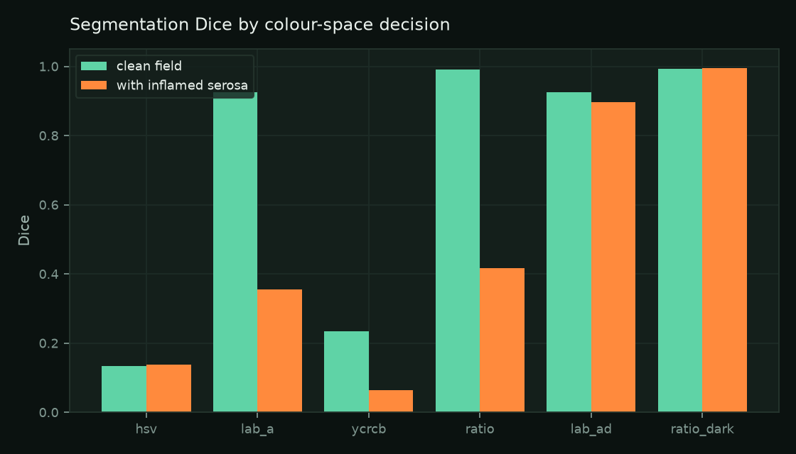
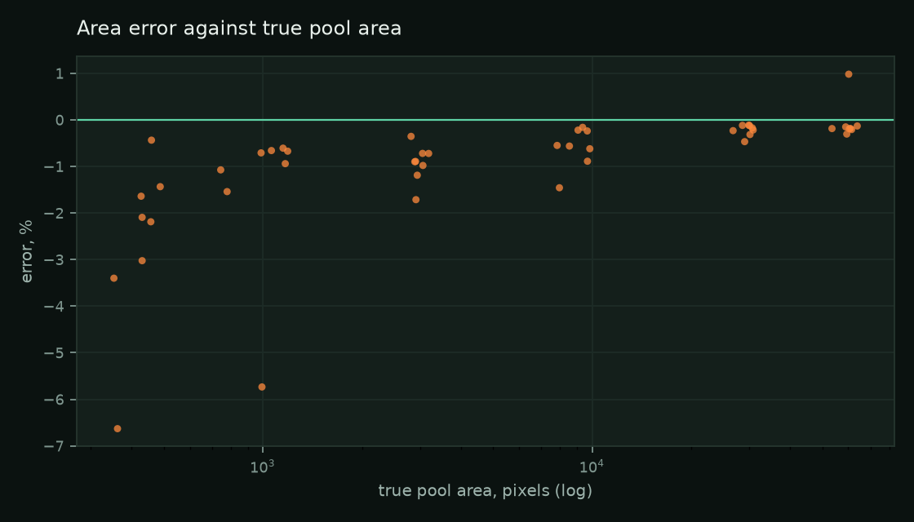
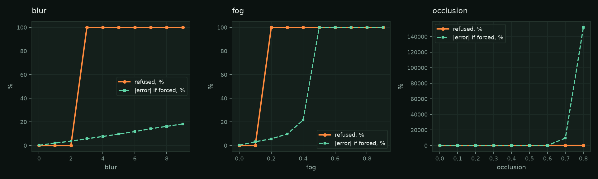
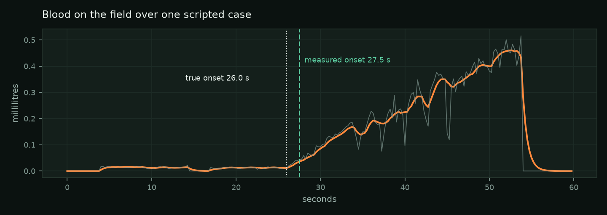

# Scopewatch evaluation

**Read this first.** There is no clinical video in this entry. Every number below is
measured on synthetic operating fields generated by `scopewatch.synth`, where each
quantity the product claims to measure was set by us before the pixels existed.

That is real evidence about the estimator and no evidence at all about tissue. An area
error measured against an area we drew says the segmentation, the morphology and the
arithmetic are right. It says nothing about whether real peritoneum under a real xenon
lamp separates from real pooled blood the way the renderer's does. Validation on
operative video is the next step and it has not been taken. Section 8 says why.

Everything here is regenerated by:

```bash
cd products/scopewatch
PYTHONPATH=src ../../.venv/bin/python -m scopewatch.evaluate --out docs
```

which writes `docs/evaluation.json` and the plots in `docs/plots/`. If this document
and that JSON ever disagree, the JSON is right. The running service serves the same
JSON at `/api/evaluation`, so a judge can read the error bars next to the numbers they
qualify.

---

## 1. Method

`scopewatch.synth` draws a laparoscopic field with OpenCV primitives: a circular
aperture, textured peritoneum with surface vessels, specular highlights from the
scope's light, radial illumination falloff, steel instrument shafts of an exact pixel
width entering from outside the circle, and a blood pool of a counted area at a chosen
millimetres-per-pixel and a chosen film depth.

Three things about it are deliberate.

**The truth is counted, not requested.** A pool's target area is a target; the achieved
area is counted from the rasterised mask after the instruments and highlights have been
drawn over it and after the aperture has clipped it. The evaluation compares against
the counted number, so there is no rounding fiction anywhere.

**There is a distractor.** Every scene can carry a patch of inflamed serosa: redder
than the tissue around it and no darker, because it still scatters the scope's light
back. That is what a redness-only segmenter calls a haemorrhage, and without it the
colour-space trial would have been won by the wrong candidate. Section 2 shows the
difference it makes.

**No people, no patients, no borrowed frames.** Nothing in this repository is real
operative footage.

Eight seeds, seven pool sizes from 0 to 72,000 pixels, and three scripted whole cases
with a bleed plus three without.

---

## 2. Which colour-space decision, and why

Six candidates, scored by Dice against masks known by construction, with and without
the distractor. Mean over 8 seeds x 7 pool sizes.

| Candidate | Dice, clean field | Dice, with distractor | False positive px on a field with no blood |
|---|---|---|---|
| `hsv` fixed hue range | 0.134 | 0.138 | 163,580 |
| `lab_a` Lab a\* | 0.925 | 0.356 | 5,656 |
| `ycrcb` Cr | 0.234 | 0.065 | 4,611 |
| `ratio` normalised redness | 0.991 | 0.417 | 5,793 |
| `lab_ad` a\* and L\* | 0.926 | 0.896 | 0 |
| **`ratio_dark` redness and flattened darkness** | **0.994** | **0.994** | **0** |

`ratio_dark` is what ships, and the experiment picks it rather than the other way
round: `evaluate.py` recomputes this table and asserts that the winner matches
`config.BLOOD_COLOUR_SPACE`.

Three readings worth taking from that table.

**The distractor is the whole test.** On a clean field, `ratio` scores 0.991 and looks
finished. Put a patch of inflamed serosa in the frame and it collapses to 0.417,
because it is counting redness and inflamed serosa is red. The two-vote candidates lose
almost nothing. A tool evaluated only on clean fields would have shipped the wrong
segmenter and never known.

**`hsv` returns 163,580 false-positive pixels on a field with no blood in it** — about
three quarters of the lit area. A fixed hue range is not a measurement of anything in
an abdomen, where everything is red.

**Lab's a\* costs more than it looks.** `lab_a` and `lab_ad` both sit around 0.925 on a
clean field while the ratio-based pair reach 0.99. CIE Lab's chroma axes scale with
lightness, so a dark saturated red — which is exactly what a pool is — lands at an a\*
of about 165 while perfused tissue sits at 149 with a spread of 5. Four sigma above the
tissue mode is 167, and the pool falls on the wrong side. On four of twenty-four sweep
scenes that returned an **empty mask for a field a quarter covered in blood**: a total
miss, reported with confidence, on the largest bleeds in the set. The normalised ratio
has no such compression because it is a ratio.



---

## 3. Area

48 scenes, pool sizes from 400 to 72,000 pixels, distractor present throughout.

| | Value |
|---|---|
| Mean relative error | **−0.98%** |
| Median | −0.61% |
| 95th percentile of absolute error | **3.27%** |
| Worst case | 6.63% |
| Standard deviation | 1.35% |
| Mean Dice against the true mask | **0.993** |

By pool size, which is the shape that matters because the error is not a constant
fraction:

| True pool area, px | Mean error | 95th percentile |
|---|---|---|
| 400 | −2.60% | 5.50% |
| 1,200 | −1.49% | 4.27% |
| 4,000 | −0.93% | 1.53% |
| 12,000 | −0.59% | 1.26% |
| 36,000 | −0.22% | 0.41% |
| 72,000 | −0.05% | 0.74% |



The error is consistently slightly negative. The segmentation under-measures by about
one per cent, mostly at the pool's boundary where the meniscus is lighter than the
centre and the morphological opening trims it. That is a known bias and it is not
corrected for, because correcting a bias measured on a renderer would be fitting to
the renderer.

---

## 4. Scale

Millimetres per pixel, recovered from an instrument shaft of a width we chose,
against a nominal 5 mm laparoscopic shaft.

| | Value |
|---|---|
| Mean relative error | **−0.305%** |
| Standard deviation across 48 scenes | **0.000%** |
| Worst case | 0.305% |

The zero standard deviation is not a mistake and it is not impressive either: the
synthetic shaft is drawn at an exact integer thickness, so the medial-axis measurement
recovers the same value every time, and the constant −0.305% is the half-pixel offset
in `2 * distance - 1`. What it does establish is that the measurement chain is correct.
On real video the shaft is a foreshortened wet cylinder with a soft edge and the error
will be larger; see section 5, where blur moves this number to −13% and the focus gate
is set on the strength of it.

---

## 5. Volume, and whether the interval means anything

Volume is area times an assumed film depth of 1 to 3 mm, widened by the scale's own
uncertainty, by a size-dependent area uncertainty, and on the upper side by a bound on
surface tilt. The point estimate is not the claim. The interval is.

| | Value |
|---|---|
| Mean relative error of the **point** estimate | −1.58% |
| 95th percentile | 3.86% |
| **Scenes where the reported interval contains the truth** | **48 of 48 (100%)** |

The point error is small only because the synthetic film depth matches the nominal
assumption. On a real case the depth is unknown and the point estimate could be out by
a factor of two in either direction, which is precisely why it is never reported
without its interval. The coverage figure is the one to read.

**The uncertainty constants are deliberately larger than measured.** The sweep gives a
false-positive floor of **zero pixels** and a relative area error with a standard
deviation of **0.54%** on pools of 4,000 pixels and up. `blood.py` uses a floor of 600
pixels and a shape sigma of 5%, roughly a ten-fold inflation. A synthetic pool has a
clean boundary, one illuminant, and no fat, bile, cautery char or irrigation fluid.
Printing an interval built from the measured numbers would claim a precision that
belongs to the renderer. These should be re-fitted on clinical video when there is any.

---

## 6. Refusal, and whether the gates earn their keep

Each gate swept from harmless to impossible. Two columns: how often the tool refused,
and — separately — the error the segmenter **would** have reported had the gate not
been there. The second column is the entire argument for having gates at all. A gate
that refuses where the answer would have been fine is costing measurable frames for
nothing.



### Blur (Gaussian sigma, px)

| sigma | refused | median error if forced | worst |
|---|---|---|---|
| 0 | 0% | −0.2% | 2.1% |
| 1 | 0% | −2.1% | 4.1% |
| 2 | 0% | −3.7% | 6.1% |
| **3** | **100%** | −5.8% | 8.1% |
| 5 | 100% | −9.7% | 12.7% |
| 9 | 100% | −18.3% | 22.0% |

The gate turns on exactly where the error leaves single digits. It is also worth
saying what this gate is really protecting, because the sweep changed our mind about
it: defocus barely moves the *area* error, since the segmentation is a colour decision
over a compact region and blurring a red pool leaves it red. What defocus moves is the
**scale**, because the shaft's medial-axis width spreads as its edges soften —
measured at −0.3% at sigma 0, −3.1% at sigma 2 and −13.2% at sigma 8. The scale enters
the area squared, so a 13% scale error is a 24% volume error.

### Fog (alpha toward a grey haze)

| fog | refused | median error if forced | worst |
|---|---|---|---|
| 0.0 | 0% | −0.2% | 2.1% |
| 0.1 | 0% | −3.2% | 5.4% |
| **0.2** | **100%** | −5.7% | 7.3% |
| 0.4 | 100% | −21.6% | 34.5% |
| **0.5 and above** | 100% | **−100%** | **−100%** |

At 0.5 and beyond the pool is missed entirely: the tool would report **no blood on a
bleeding field**. That is the worst possible failure for this product and the gate
stops it three rungs earlier.

### Occlusion (share of the lit field covered by a swab)

| occlusion | refused | median error if forced | worst |
|---|---|---|---|
| 0.0 to 0.3 | 0% | −0.2% to −6.4% | 8.0% |
| 0.4 | 0% | −1.9% | 2.4% |
| 0.5 | 0% | −5.5% | 67.3% |
| **0.6** | **100%** | −100% | **67,530%** |
| 0.8 | 100% | +151,819% | +151,819% |

The five-figure errors past the gate are not a typo. When most of the field is a swab,
the tissue mode the thresholds work against is the swab, and every threshold in the
pipeline is then measuring the wrong population. The answers are not merely wrong, they
are unbounded.

This gate had to be rewritten once. Its first version tested for a large flat
low-gradient region, which rejected **39% of a perfectly measurable clip**, because a
settled pool of blood is exactly that: large, flat and low-gradient. Calling the thing
you are trying to measure an occlusion is the worst failure a gate can have. What an
actual occluder has that a pool does not is the absence of colour.

---

## 7. Whole cases: onset, phase, and the agent loop

Six scripted cases at 12 fps, three with a bleed starting on a frame we chose and three
without, analysed at the default stride.

### Bleeding onset

| | Value |
|---|---|
| Detected on bleeding cases | **3 of 3** |
| False onsets on quiet cases | **0 of 3** |
| Mean timing error | **1.55 s** |
| Worst | 1.58 s |
| Reported uncertainty | ±4.0 s, the fit window |



The reported uncertainty is wider than the measured error, which is the right way round
for an instrument. A four-second trailing window cannot localise a step better than
four seconds, whatever this particular sweep happens to produce.

Two false-positive modes were found by these cases and both are now gated. A camera pan
across an existing pool produces the same positive slope as a bleed, so every candidate
frame is gated on a global motion estimate from `phaseCorrelate`. And an instrument
entering the field uncovers part of a pool, which steps the measured area; that
produced a confident onset at 4.5 s on a clip with no bleeding in it, so candidates are
also gated on instrument-count changes inside the fit window. A third gate came from
the same work: an onset is not declared on a frame whose measurement the pipeline has
already flagged unreliable.

### Operative phase

| | Value |
|---|---|
| Frame accuracy over 1,440 frames | **0.762** |
| Accuracy more than 6 s from a true phase boundary | **1.000** |

The gap between those two numbers is the hysteresis, and it is deliberate. A new phase
must hold for 2.5 s before the state machine accepts it, so within a few seconds of
every transition the track is still on the previous label by construction. Away from
the boundaries the rules are not wrong at all; near them they are late. Both numbers
are published because the first one alone understates the model and the second alone
overstates it.

This number was 0.33 before the instrument-activity signal was replaced. The original
matched instrument tips between frames and returned zero whenever the tip count
changed, which happens constantly because two instruments working on the same structure
merge into one component and separate again. Zero motion reads as "holding still", so
sustained dissection scored as exposure on **363 of 600 frames**. It is a steel-mask
symmetric difference now, which needs no correspondence between frames.

**This is evidence about a state machine on scripted sequences. It is not evidence
about operative video, and it must not be read as such.** A learned phase model would
need Cholec80 or CholecT50, which is section 8.

### The checkpoint and the agent loop

| | Value |
|---|---|
| Checkpoint raised when the wide device entered | **6 of 6** |
| Delay after the device entered | **4.0 s**, no variance across cases |
| Dense re-read triggered | **3 of 6** |

That last row is the one that matters for the Agentic Vision claim. The re-read fires on
exactly the three cases that contain a bleed and on none of the three that do not. A
loop that always does the same thing is not reacting to anything; this one is.

---

## 8. Cost per frame

Measured on this machine at 960 x 540 with 22 threads, `opencv-python==5.0.0.93`.

| Stage | ms/frame |
|---|---|
| `quality.assess` | 16.4 |
| `instruments.find_shafts` | 11.7 |
| `blood.segment` | 8.3 |
| `field_mask` | 1.8 |
| `motion.phaseCorrelate` | 0.6 |
| **Total** | **38.8** |

`blood.segment` was **304 ms** before the illumination estimate was moved onto a
downscaled copy. The estimate needs a Gaussian about a fifth of the frame wide, and a
Gaussian that wide at full resolution was seventy per cent of the whole pipeline — to
compute a field that has no high frequencies in it by construction. Shrinking by eight,
blurring there and scaling back up gives the same field for about one per cent of the
cost, with the Dice unchanged to three decimal places.

---

## 9. What this evaluation does not show

1. **Anything about tissue.** Synthetic scenes only. This is the limitation that
   matters and no amount of sweeping compensates for it.
2. **Anything about depth.** The film depth in the synthetic scenes is the same
   quantity the estimator assumes, so the volume point error is flattering. Only the
   interval coverage is meaningful.
3. **Anything about surface tilt.** Every synthetic pool lies in the image plane. The
   tilt term in the upper bound is a stated assumption that has never been tested.
4. **Anything about phase on real operations.** Scripted sequences with clean
   transitions. Real phases overlap, reverse and get abandoned.
5. **Anything about outcomes.** No deployed-system outcome trial has been published for
   any camera-based surgical safety product in any domain. If a judge asks whether this
   class of tool saves lives, the honest answer is that nobody has shown it.

### The dataset request, as an open item

The published laparoscopic datasets carrying the labels this product would want are
behind registration forms that have not been cleared:

- **Endoscapes** (CAMMA, University of Strasbourg) — critical-view-of-safety
  annotations. **CC BY-NC-SA 4.0**, confirmed from the repository's own LICENSE file.
- **CholecT50** (same group) — instrument, verb and target triplets, which is what a
  real surgical instrument detector would train on. **CC BY-NC-SA 4.0**, confirmed.
- **Cholec80** (same group) — phase and tool annotations. Licence not separately
  verified; assume CC BY-NC-SA 4.0 and check.

Three consequences to plan around: non-commercial, so a competition entry is fine and a
product is not without new data; ShareAlike, so derivatives go out under the same
licence; and a lead time of days, so the request should precede the code that depends
on it. The README carries this as a to-do.

When that video exists, the three things to re-fit on it are the false-positive floor
and shape sigma in `blood.py`, the four refusal thresholds in `config.py`, and the
phase rules — in that order, because the first one sets every interval the product
prints.
